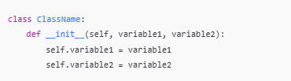
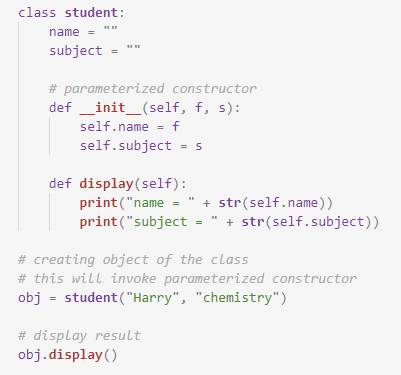

Inheritance is a feature that says if you define a new class giving a reference of some other class then due to inheriting property of python your new class will inherit all attributes and behavior of the parent class.
A Constructor is a special kind of method that have same name as the class in python self variable do the same. It can be used to set the values of the members of an object.

How to define constructor
Syntax:
  
How to give values to objects using constructors
<b>Types of constructors : </b>  

default constructor: The default constructor is a simple constructor which doesn’t accept any arguments. Its definition has only one argument which is a reference to the instance being constructed.
parameterized constructor: constructor with parameters is known as parameterized constructor. The parameterized constructor takes its first argument as a reference to the instance being constructed known as self and the rest of the arguments are provided by the programmer.
  
How to call objects using constructors:  
Syntax: 
Object_name=class_name('variable values',variable values)  
Program  
  
Output 
1000  
How to inherit a class  
Syntax:  
class class_name(parent class name)  
How to check whether it is inherited or not  
Syntax:  
Object_name = inherited_class_name('variable1,variable2') 
print(Object_name.variable1) 
Output: variable value. 
Program  
  
Output  
Geek1 False 
Geek2 True

